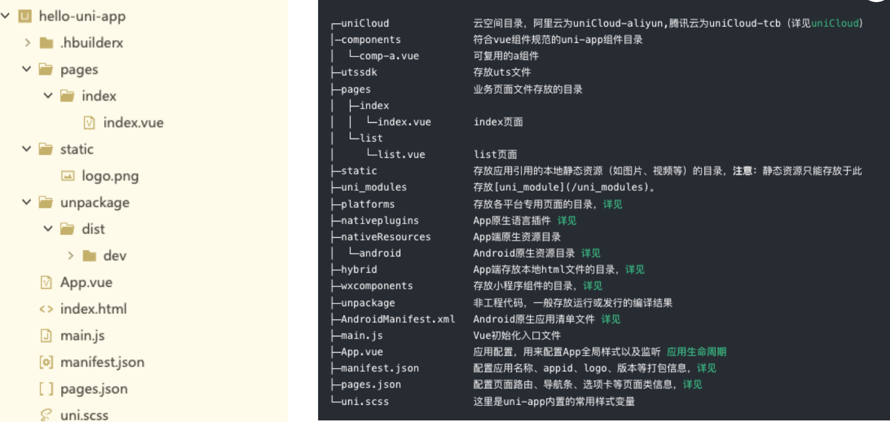

跨平台开发的特点(**一套代码，多端应用**)
- **可以跨平台，一套代码搞定iOS、Android、微信小程序、H5应用等**
- 开发成本较低，开发周期比原生短
- 适用于跟系统交互少、页面不太复杂的场景
- 但是对开发者要求高，除了本身JS的了解，还必须熟悉一点原生开发
- 不适合做高性能、复杂用户体验，以及定制高的应用程序。比如：抖音、微信、QQ等
- 同时开发多端兼容和适配比较麻烦、调试起来不方便

跨平台发展史
- 应该如何选择？建议
    - 需要做高性能、复杂用户体验、定制高的APP、需硬件支持的选 原生开发
    - 需要性能较好、体验好、跨Android、iOS平台、 H5平台、也需要硬件支持的选 Flutter（采用Dart开发）
    - 需要跨小程序、H5平台、Android、iOS平台、不太复杂的先选 uni-app，其次选 Taro
    - 不需要扩平台的，选择对应技术框架即可。
- uniapp + vue
    - 适合开发整体 App
    - 支持平台
        - Android
        - IOS
        - Web
        - 小程序
        - 快应用

认识uniapp
- uni-app 是一个使用 **Vue.js** 开发前端应用的框架。
- 即开发者编写一套代码，便可发布到iOS、Android、Web（响应式）、以及各种小程序（微信/支付宝/百度/头条/飞书/QQ/快手/钉钉/淘宝）、快应用等多个平台。
- uni-app在手，做啥都不愁。即使不跨端， **uni-app也是更好的小程序开发框架、更好的App跨平台框架、更方便的H5开发框架**。不管领导安排什么样的项目，你都可以快速交付，不需要转换开发思维、不需要更改开发习惯。

uniapp VS 微信小程序
- uni-app支持跨平台，编写一套代码，可以发布到多个平台，而微信小程序不支持
- **uni-app纯Vue体验**、高效、统一、工程化强，微信小程序工程化弱、使用小程序开发语言
- 微信小程序适合较复杂、定制性较高、兼容和稳定性更好的应用
- uni-app适合不太复杂的应用，因为需要兼容多端，多端一起兼容和适配增加了开发者心智负担
    
uniapp 和 微信小程序，应该如何选择？
- **需要跨平台、不太复杂的应用选 uni-app**，复杂的应用使用uni-app反而增加了难度。
- 不需要跨平台、较复杂、对兼容和稳定性要求高的选原生微信小程序。

uniapp初体验
- 创建uni-app项目
    - HBuilder【需要创建一个账号才能进行打包和部署等情况】

- 运行uni-app
    - 在浏览器中运行
        - 直接点击软件中的运行操作；

    - 在微信开发者工具中运行
        -  选中uniapp项目，点击工具栏的运行 -> 运行到小程序模拟器 -> 微信开发者工具，即可在微信开发者工具里面体验 uni-app。
        - 注意事项
            - 1.微信开发者工具需要开启服务端口：小程序开发工具设置 -> 安全（目的是让HBuilder可以启动微信开发者工具）
            - 2.如第一次使用，需配置微信开发者工具的安装路径（会提示下图）。
            ➢ 点击工具栏运行 -> 运行到小程序模拟器 -> 运行设置，配置相应小程序开发者工具的安装路径
            - 3.自动启动失败，可用微信开发者工具手动打开项目（项目在unpackage/dist/dev/mp-weixin路径下）
        - 在mac中可以直接利用微信开发者工具打开相应的内容；window需要填写路径
        - 下载相应的路径；
    - 运行App到手机或者模拟器当中；【需要先安装模拟器】
        - 先连接真机 或者 模拟器（Android的还需要配置adb调试桥命令行工具） - 选中uniapp项目，点击工具栏的运行 -> 运行App到手机或模拟器，即可在该设备里面体验uni-app（支持中文路径）
        - ！！！@
            - HBuilder => Mumu手机模拟器【中间需要adb调试桥；命令行工具】
                - 1、连接手机设备
                - 2、安装App
                - 3、调试【打印log】
                - 4、热更新
            - abd调试桥【图】
            - mac电脑直接安装Xcode即可

    - 设置 => 安全设置 => 开启服务端口

项目的目录结构
- 

- 重要的目录结构详解
	- pages；业务页面文件存放的目录
	- unpackage；非工程代码，一般存放运行或发行的编译结果
	- main.js；Vue初始化入口文件
	- App.vue；应用配置，用来配置App全局样式以及监听应用生命周期
	- pages.json；配置页面路由、导航条、选项卡等页面类信息
	- uni.scss；这里是uni-app内置的常用样式变量

main.js
- ✓初始化vue实例。
- ✓ 定义全局组件。
- ✓ 定义全局属性。
- ✓ 安装插件，如：pinia、vuex 等。

App.vue【注意：应用生命的周期仅可在App.vue中监听，在页面监听无效】
- App.vue入口文件
    - App.vue是uni-app的入口组件，所有页面都是在App.vue下进行切换
    - App.vue本身不是页面，这里不能编写视图元素，也就是没有<template>元素
- App.vue的作用
    - 应用的生命周期
    - 编写全局样式
    - 定义全局数据globalData

uni.scss【全局的样式 & 局部的样式】
- 在此文件可以定义全局变量
- 在其他文件调用时，用的预处理器需要指定为scss；lang = "scss"

rpx 和 px 都是计量单位，但用途不同。
- px：像素（Pixel），是一个绝对单位，表示屏幕上的一个点。
- rpx：响应式像素（Responsive Pixel），是相对长度单位，可以根据屏幕宽度进行自适应缩放。在微信小程序中，屏幕宽度为 750rpx，即屏幕可视宽度等于 750 个响应式像素。因此，1rpx 约等于 0.5px。

定义全局的数据【App.vue】

页面接口的调用

page.json
- 同小程序中的app.json / app.config.json

manifest.json文件
- 应用配置文件
- **可视化配置文件**

内置组件
- 复习开发规范
- view是跨平台组件；div就不是
    - 常见的内置组件
        - view
        - text
        - button
            - type:primary
            - 该主题色在不同的平台显示出来的效果是不同的；
            - 解决方案
                - 1. 自己封装一个button
		        - 2. 重写button的样式( 条件编译 )
        - image
            - 相对路径
            - 绝对路径
            - 外部导入进来的图片
            - base64字符串
            - 下方的style中可以书写相应的样式
        - scrollview；可滚动视图区域，用于区域滚动
            - 垂直滚动
            - 水平滚动
        - swiper
            - 轮播图
扩展组件 ～ ui组件库(uni-ui)
- 什么是 uni-ui？
    - uni-ui是DCloud提供的一个UI组件库，一套基于Vue组件、flex布局的**跨全端UI框架**。
    - uni-ui**不包括uni-app框架提供的基础组件，而是基础组件的补充。**
    - 详情：https://uniapp.dcloud.net.cn/component/uniui/uni-ui.html
- 特点
    - 高性能
    - 全端
    - 风格扩展
        - 支持在un.css，可以方便的扩展和切换应用风格
        - 在官网中查看

        

